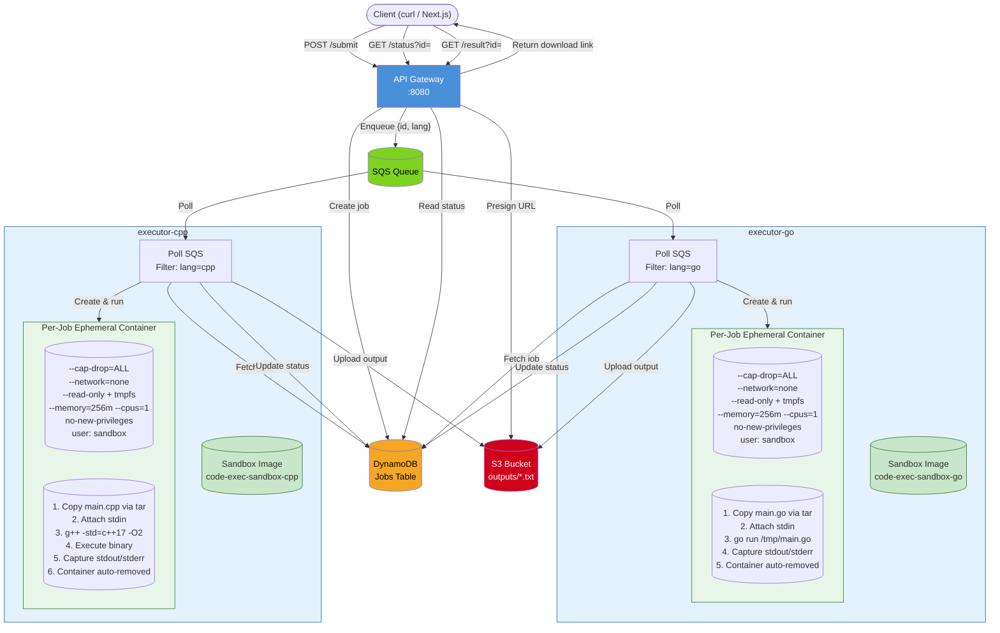

# Remote Code Execution Microservices (Go + C++)

This project provides a minimal microservice architecture for remote code execution supporting Go and C++.

## Components

- **api-gateway**: Accepts submissions, exposes status/result endpoints.
- **executor-go**: Polls SQS for Go jobs, spawns an ephemeral Docker container per job with full sandbox isolation, captures output, uploads to S3, updates DynamoDB.
- **executor-cpp**: Same pattern as executor-go but for C++ (compiles with `g++ -std=c++17 -O2` inside the sandbox container).
- **shared**: Common models, config, store (DynamoDB helpers), and queue helpers.
- **sandbox-images/**: Minimal Docker images (`code-exec-sandbox-go`, `code-exec-sandbox-cpp`) with a non-root `sandbox` user — used by executors as the base for per-job containers.

## Data Flow

1. Client POSTs `/submit` with `{ userId, language: go|cpp, code, input }`.
2. `api-gateway` stores job (status=queued) in DynamoDB and pushes minimal message `{executionId, language}` to SQS.
3. Appropriate executor polls SQS, fetches job from DynamoDB, marks `running`.
4. Executor creates an **ephemeral Docker container** with the user's code copied in, executes it under sandbox constraints (see [Sandboxing Layer](#sandboxing-layer)), captures stdout/stderr.
5. Output uploaded to S3 as `outputs/<executionId>.txt`, DynamoDB updated with status, preview, metadata.
6. The ephemeral container is **auto-removed**.
7. Client polls `/status?id=<executionId>` or requests `/result?id=<executionId>` for a presigned URL + preview.

## DynamoDB Item Fields

| Field                                           | Description                               |
| ----------------------------------------------- | ----------------------------------------- | ------- | --------- | ------ | ------- |
| executionId (PK)                                | Unique job id                             |
| userId                                          | Arbitrary user identifier                 |
| language                                        | go or cpp                                 |
| code                                            | Raw source code                           |
| input                                           | Optional stdin content                    |
| status                                          | queued                                    | running | completed | failed | timeout |
| error                                           | Error/truncated stderr message            |
| outputPath                                      | S3 URI of combined output file            |
| stdoutPreview                                   | First ~500 chars of stdout                |
| createdAt / updatedAt / startedAt / completedAt | Timestamps (RFC3339)                      |
| execDurationMs                                  | Milliseconds runtime (excludes S3 upload) |

## Environment Variables

Set these via a `.env` file or exported in the shell (compose passes through):

| Variable | Required | Default | Description |
|---|---|---|---|
| `AWS_REGION` | Yes | — | AWS region |
| `AWS_ACCESS_KEY_ID` | Yes | — | AWS access key (dummy for LocalStack) |
| `AWS_SECRET_ACCESS_KEY` | Yes | — | AWS secret key (dummy for LocalStack) |
| `DYNAMODB_TABLE` | Yes | — | DynamoDB job table name |
| `CODE_EXEC_BUCKET` | Yes | — | S3 bucket for execution outputs |
| `SQS_QUEUE_URL` | Yes | — | SQS queue URL |
| `EXEC_TIMEOUT_SEC` | No | `10` | Max seconds per job |
| `SANDBOX_IMAGE` | No | `code-exec-sandbox-{lang}:latest` | Sandbox image for the executor |
| `SANDBOX_RUNTIME` | No | (Docker default) | Runtime to use for sandbox containers: empty = `runc`, `runsc` = gVisor |

## Local Development

### Build & Run (Docker Compose)

```bash
# 1. Ensure env vars exported or placed in a .env file
# 2. Build sandbox images first, then services, then start
make
# Or manually:
#   docker compose build sandbox-go sandbox-cpp
#   docker compose build
#   docker compose up -d

# View logs
docker compose logs -f executor-go
docker compose logs -f executor-cpp

# Stop everything
make down
```

### Submit a Job

```bash
curl -X POST http://localhost:8080/submit \
  -H 'Content-Type: application/json' \
  -d '{"userId":"u1","language":"go","code":"package main\nimport (\n\t\"fmt\"\n)\nfunc main(){fmt.Println(\"hi\")}","input":""}'
```

Response:

```json
{
  "executionId": "...",
  "status": "queued",
  "language": "go",
  ...
}
```

### Check Status

```bash
curl "http://localhost:8080/status?id=<executionId>"
```

Will include: status, stdoutPreview (after completion), error, outputPath.

### Get Result (Presigned URL)

```bash
curl "http://localhost:8080/result?id=<executionId>"
```

Returns JSON with `url` and `stdoutPreview`.

## Frontend (Next.js)

A simple, nice web UI is included under `frontend/` (Next.js + TypeScript + Tailwind + Monaco editor).

Features:

- Language selector (Go, C++) with starter templates
- Monaco editor with dark theme
- Stdin input box and userId field
- Submit job, auto-poll status, show stdout preview
- Download full output via presigned S3 URL

The frontend proxies `/api/*` requests to `http://localhost:8080/*` during development (see `frontend/next.config.mjs`), avoiding CORS issues.

### Run the frontend

Prereqs: Node.js 18+ and pnpm/npm installed.

```bash
cd frontend
npm install
npm run dev
# open http://localhost:3000
```

Make sure the backend is running on `http://localhost:8080` (via `docker compose up -d`) so the UI can submit and poll jobs.

## C++ Example

```bash
curl -X POST http://localhost:8080/submit \
  -H 'Content-Type: application/json' \
  -d '{"userId":"u1","language":"cpp","code":"#include <bits/stdc++.h>\nusing namespace std; int main(){string s; if(!(cin>>s)) return 0; cout<<s<<\\n;}","input":"hello"}'
```

## Timeout Handling

If execution exceeds `EXEC_TIMEOUT_SEC`, the sandbox container is killed with SIGKILL and status becomes `timeout`.

## Sandboxing Layer

Each user code submission executes inside its own **ephemeral Docker container** with the following restrictions:

| Layer | Setting | What it prevents |
|---|---|---|
| **Capabilities** | `--cap-drop=ALL` | No privilege escalation (`CAP_SYS_ADMIN`, `CAP_NET_RAW`, `CAP_SYS_PTRACE`, etc.) |
| **Privilege escalation** | `--security-opt no-new-privileges:true` | No setuid/setgid binary exploitation |
| **Network** | `--network=none` | No outbound connections, no data exfiltration, no crypto mining |
| **Filesystem** | `--read-only` + tmpfs `/tmp` (64MB, noexec, nosuid) | Cannot modify filesystem; scratch space is RAM-only and limited |
| **Memory** | 256MB limit, no swap | Fork bombs and memory exhaustion are contained |
| **CPU** | 1 core limit | CPU-bound loops cannot starve other jobs |
| **Processes** | Max 64 PIDs | Fork bombs are limited |
| **User** | Non-root `sandbox` (UID 1000) | No root access inside container |
| **Credentials** | No AWS env vars in sandbox | Even a container escape yields no cloud credentials |
| **Image** | Minimal (Go: `golang:alpine`, C++: `alpine`+`g++`) | Small attack surface |
| **Cleanup** | `AutoRemove=true` | Container is deleted immediately after exit |
| **Runtime (optional)** | `SANDBOX_RUNTIME=runsc` | gVisor intercepts all syscalls with a userspace kernel |
| **Orchestrator user** | Executor runs as `root` (no `USER` in executor Dockerfile) | Required to access `/var/run/docker.sock` (mode 660, owned `root:docker`). Mitigated by `cap_drop: ALL` + `no-new-privileges` on the executor container. |
| **Docker socket** | `/var/run/docker.sock` mounted `:ro` in executor | The `:ro` flag only protects the socket file — any process with access can issue **any** Docker API call (create privileged containers, mount host paths, etc.). This gives the executor process root-equivalent host access. The per-job sandbox containers do **not** have the socket. See [Threat Model](#threat-model) item 1 for mitigation. |

### gVisor Integration

For syscall-level sandboxing (the same approach Google Colab uses), install gVisor on the host and set `SANDBOX_RUNTIME=runsc`:

```bash
# On the Docker host (Linux only):
#   https://gvisor.dev/docs/user_guide/install/
sudo apt install runsc
sudo runsc install
sudo systemctl restart docker

# Then in docker-compose.override.yml or .env:
# SANDBOX_RUNTIME=runsc
```

When `SANDBOX_RUNTIME` is set, all per-job sandbox containers run under gVisor's `runsc` OCI runtime, which provides a user-space kernel that intercepts and mediates every syscall. This protects against kernel-level exploits even if the container isolation is bypassed.

### Threat Model

This sandboxing is appropriate for executing **untrusted user code** in a multi-tenant environment. The primary risks that remain:

1. **Docker socket equivalent root**: The executor container has `/var/run/docker.sock` (read-only mount) to create per-job sandbox containers. While the `:ro` flag prevents modifying the socket file, any process with access to this socket can issue any Docker API call — including creating privileged containers with host mounts. This means the **executor process itself** has effectively root-equivalent access to the host. The per-job sandbox containers do **not** have the socket mounted, but the executor orchestrator runs as `root` (required for socket access) with `cap_drop: ALL` and `no-new-privileges:true` as defense-in-depth.
   - **Mitigation**: Deploy a [docker-socket-proxy](https://github.com/Tecnativa/docker-socket-proxy) that whitelists only the API endpoints needed (`/containers/create`, `/containers/{id}/start`, `/containers/{id}/attach`, `/containers/{id}/wait`, `/containers/{id}/logs`, `/containers/{id}/kill`, `/containers/{id}/remove`). Then mount the proxy's socket instead of the Docker daemon socket.

2. **Output size**: A malicious program can produce gigabytes of output, consuming executor memory. Mitigation: output is buffered in the executor process (256MB memory limit helps contain this).

3. **Side-channel attacks**: Timing attacks and cache-based information leaks across sandbox containers sharing a CPU core.

4. **Docker daemon vulnerabilities**: If the Docker daemon itself is compromised, all sandboxes are compromised. Keeping Docker updated mitigates this.

5. **gVisor coverage**: Some syscalls are not fully intercepted by gVisor; check [gVisor compatibility](https://gvisor.dev/docs/user_guide/compatibility/) for details.

## Future Enhancements

- **Docker socket proxy**: Replace direct Docker socket mount with [docker-socket-proxy](https://github.com/Tecnativa/docker-socket-proxy) to whitelist only the required API endpoints, removing the executor's root-equivalent host access.
- LocalStack docker-compose integration.
- Per-language SQS queues / SNS fan-out.
- Rate limiting & auth (API keys / JWT).
- Output size streaming & pagination.
- Persistent logs & metrics (CloudWatch / OpenTelemetry).
- Websocket / SSE for real-time status updates.

## Adding a New Language (Pure Dependency Injection)

Language support is configured explicitly where the API server is built (see `api-gateway/server.go`). There is no implicit default resolver; you must list every supported language when constructing the resolver.

Steps:

1. Edit `api-gateway/server.go` and locate the `languages.NewResolver([...])` call. Add a new entry to the slice:

```go
langResolver: languages.NewResolver([]languages.Language{
  {Name: "go",  Aliases: []string{"golang"}, DisplayName: "Go"},
  {Name: "cpp", Aliases: []string{"c++"},   DisplayName: "C++"},
  {Name: "python", Aliases: []string{"py"}, DisplayName: "Python"}, // <--- added
})
```

2. (Optional but recommended) If you need shared normalization data, you can create a helper in `shared/languages` (e.g. a function returning the slice) and reference it from `server.go` to avoid duplication across tests.

3. Create a sandbox image (`sandbox-images/python/Dockerfile`) with a `sandbox` non-root user and the Python runtime:

```dockerfile
FROM python:3.12-alpine
RUN adduser -D -u 1000 sandbox
USER sandbox
WORKDIR /home/sandbox
```

4. Add the sandbox build to `docker-compose.yml` and `depends_on`:

```yaml
sandbox-python:
  image: code-exec-sandbox-python:latest
  build:
    context: .
    dockerfile: sandbox-images/python/Dockerfile
  profiles: ["build"]
```

5. Create `executor-python/main.go` modeled after `executor-go/main.go`:
   - Use `code-exec-sandbox-python:latest` as the sandbox image
   - Command: `sh -c "cat > /tmp/main.py && python3 /tmp/main.py"`
   - Same Docker SDK sandbox container config (cap drop, no network, resource limits, etc.)

6. Add to `docker-compose.yml`:

```yaml
executor-python:
  build:
    context: .
    dockerfile: executor-python/Dockerfile
  image: code-executor-python:latest
  environment:
    ... (same env vars as other executors)
    - SANDBOX_IMAGE=code-exec-sandbox-python:latest
  volumes:
    - /var/run/docker.sock:/var/run/docker.sock:ro
  security_opt:
    - no-new-privileges:true
  cap_drop:
    - ALL
  mem_limit: 256m
  cpu: 1
  restart: unless-stopped
```

7. Rebuild and start:

```bash
# Build sandbox image first
docker compose build sandbox-python
# Build executor
docker compose build executor-python
# Start
docker compose up -d executor-python
```

8. Submit jobs with `"language": "python"` (aliases like `py` will normalize to `python`).

Because construction is explicit, you can feature‑flag or dynamically construct the slice (e.g. from a config file) before passing it to `languages.NewResolver`. If you later remove a language from the slice, the API will start rejecting it immediately with a 400 (unsupported language).

## Cleanup & Costs

Ensure you delete S3 objects and DynamoDB items for test jobs to control costs in real AWS.

## Architecture Diagram



## Troubleshooting

- Stuck in queued: check executors logs & SQS queue size.
- Missing outputPath: verify S3 bucket exists & permissions.
- Timeout quickly: adjust `EXEC_TIMEOUT_SEC`.
- Docker build issues: ensure relative `shared` module path matches build context.
- `Cannot connect to the Docker daemon` in executor logs: the Docker socket is not mounted or inaccessible. Ensure `/var/run/docker.sock` exists on the host and is mounted in docker-compose. The executor runs as `root` inside its container (required for socket access), so file-level permissions are not an issue — but if you switch to a non-root user, you must also match the socket's GID (typically `docker` group) or use `chmod` on the socket mount.
- `Container create failed: image not found`: the sandbox image was not built. Run `make sandbox-images` or `docker compose build sandbox-go sandbox-cpp`.
- Sandbox containers not being cleaned up: they should auto-remove on exit. If an executor crashes mid-job, the `defer ContainerRemove` (with `Force: true`) ensures cleanup.

---

This README covers how to run, extend, and harden the system.
